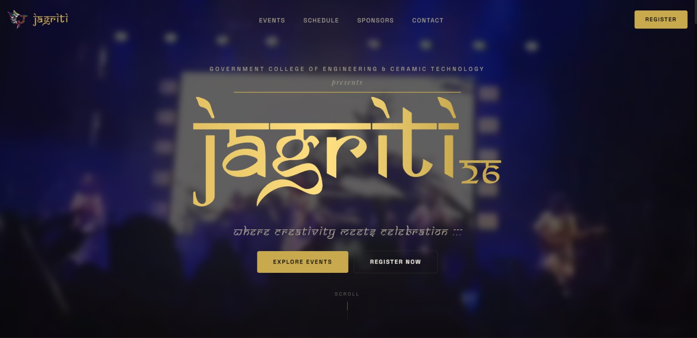

# Jagriti '26

> Official website for **Jagriti '26** — the annual cultural festival of Government College of Engineering & Ceramic Technology, Kolkata.



---

## About

Jagriti is a celebration where creativity meets celebration. The website serves as the central hub for event information, schedules, artist lineups, sponsors, team details, and registrations.

---

## Tech Stack

- **React 19** — component-based UI
- **Vite** — fast dev server & build tool
- **Tailwind CSS v4** — utility-first styling with custom theme tokens
- **GSAP + ScrollTrigger** — scroll-driven animations & parallax effects
- **Bun** — package manager & script runner

---

## Project Structure

```text
src/
  components/
    Navbar.jsx          # Fixed top nav with mobile hamburger overlay
    HeroSection.jsx     # Full-screen hero with GSAP entrance animation
    AboutSection.jsx    # About section with floating photo collage
    EventsSection.jsx   # Events — hover accordion (desktop) / tap accordion (mobile)
    BandLineupSection.jsx  # Band lineup with scroll-pinned stacking cards (desktop)
    ScheduleSection.jsx # Festival schedule with day selector
    SponsorsSection.jsx # Sponsor logo grid
    TeamSection.jsx     # Team member grid with animated cards
    ContactSection.jsx  # Contact form & info
    Footer.jsx          # Footer with GSAP parallax (desktop) / static (mobile)
public/
  fonts/                # Custom fonts (Samarkan, etc.)
  images/               # Event, sponsor & team assets
```

---

## Getting Started

```bash
# Install dependencies
bun install

# Start development server
bun run dev

# Build for production
bun run build
```

---

## License

All rights reserved. This project is proprietary to the Jagriti '26 organizing committee.
